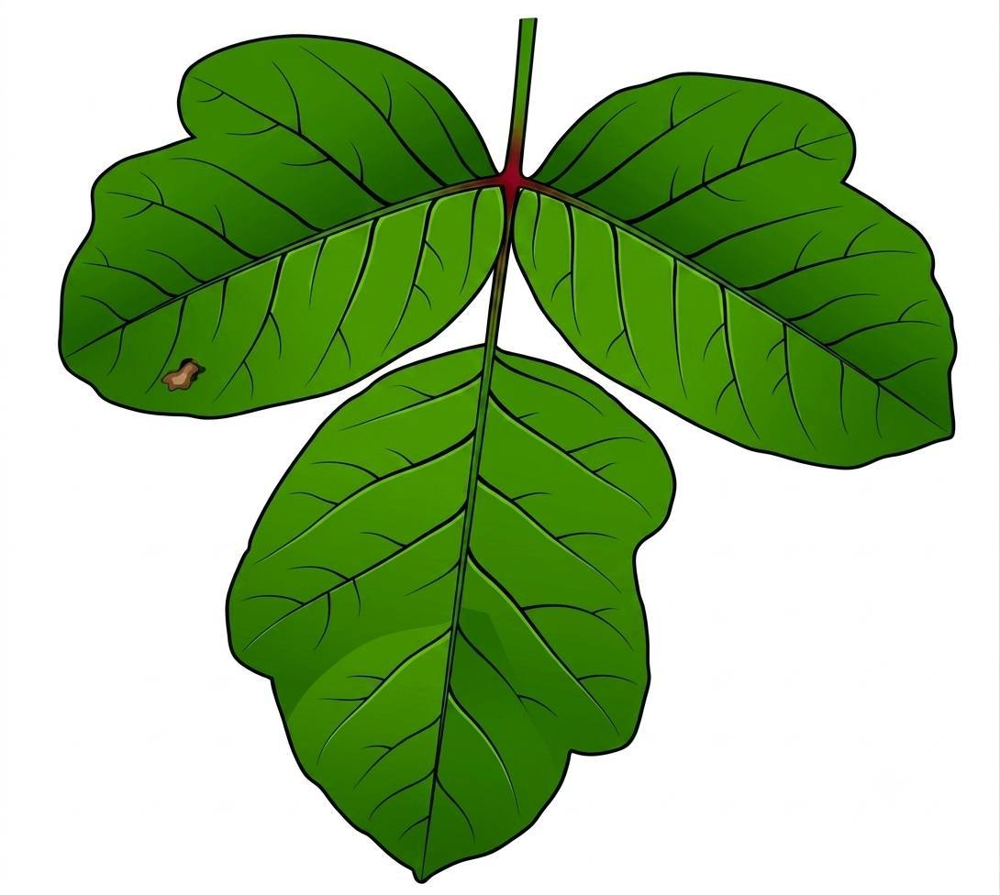
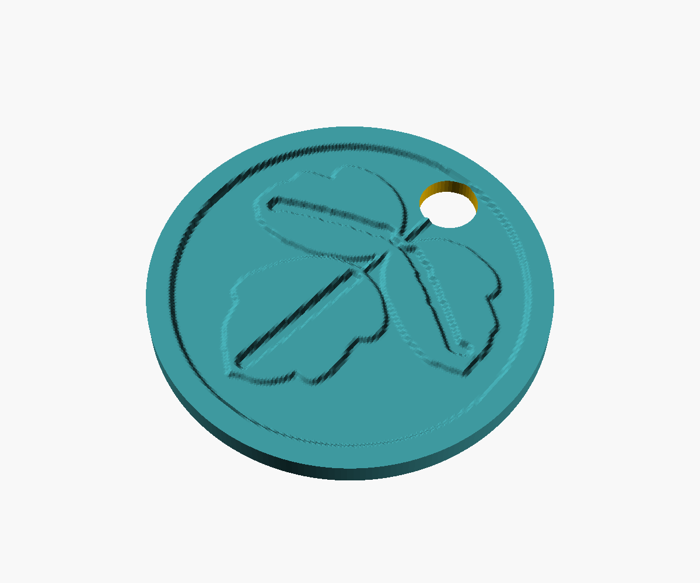
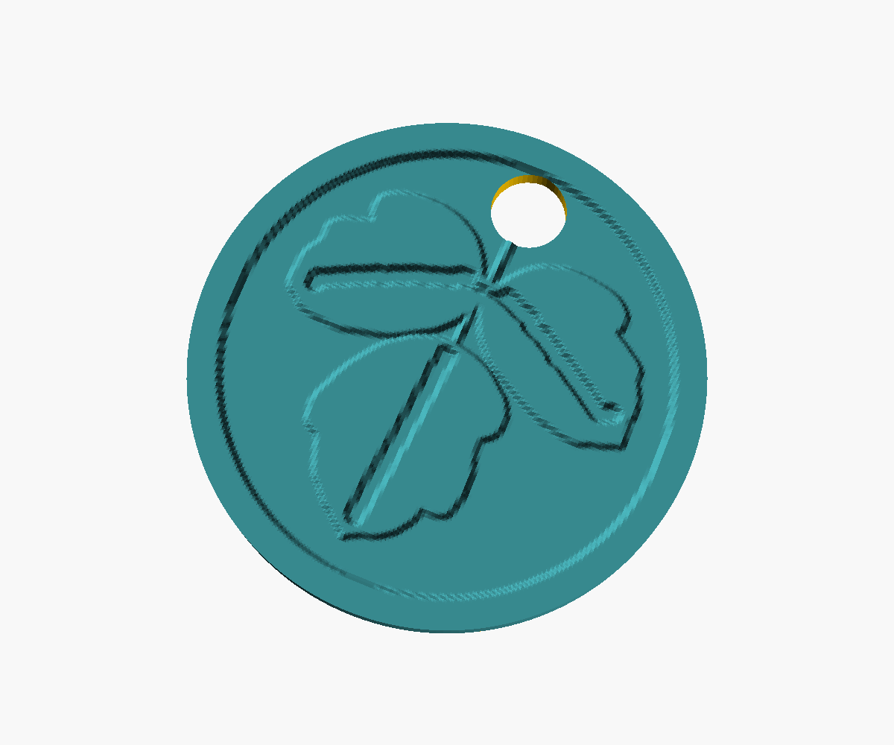
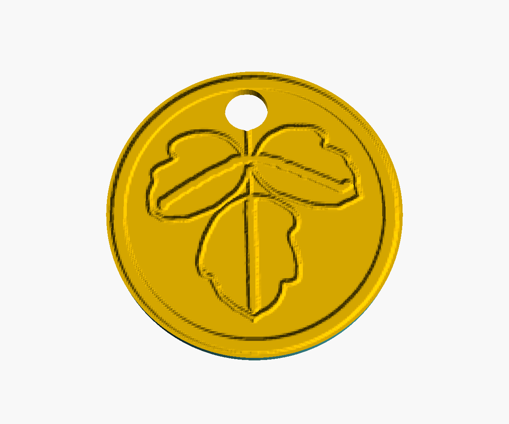
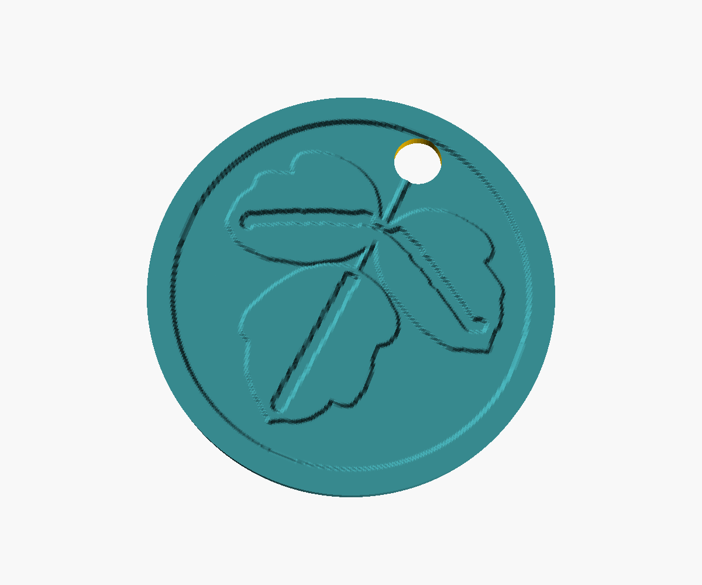
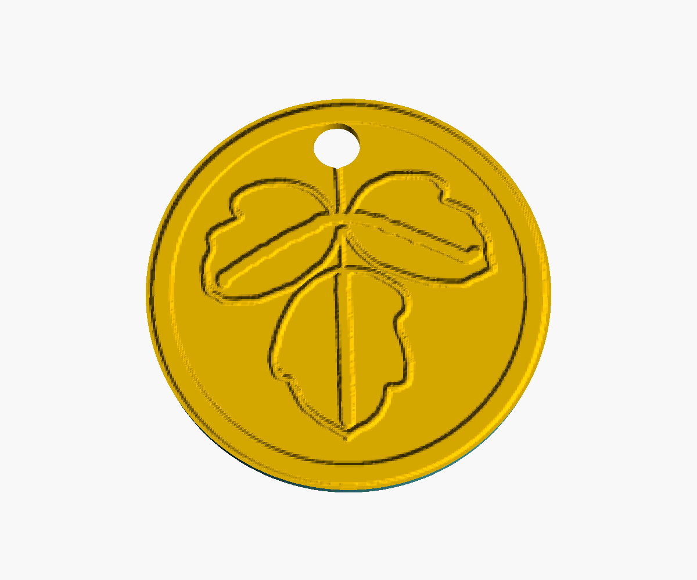
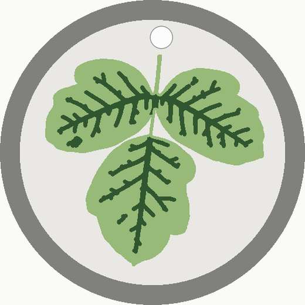
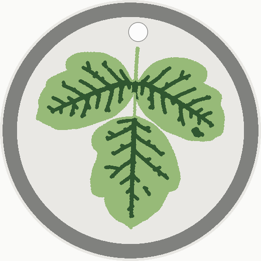

# Poison-Oak Tokens

Physical tokens to help Scouts learn to recognize poison oak by its
leaves-of-three shape — a safe, touchable way to study the plant, given as a
reward for learning to spot it in the field.

Each token is a printable coin/bead bearing a trifoliate poison-oak leaf,
traced from a real leaf illustration.

<p align="center">


</p>

*Left: the real plant. Right: the illustration the tokens' relief was traced
from (line art extracted by black-hat morphology, baked to grayscale
heightmaps, embossed via OpenSCAD `surface()`).* Three final designs, each
a self-contained OpenSCAD model: the `.scad` plus the two grayscale heightmaps
in its folder reproduce the STL exactly.

| Token | Design | Hole | Thickness |
|---|---|---|---|
| **20 mm** (`20mm/`) | Single-vein: one midrib stroke per leaflet | Ø3.0 mm | 3.20 mm |
| **25 mm** (`25mm/`) | The same single-vein design at 1.25× | Ø3.0 mm | 3.20 mm |
| **40 mm** (`40mm/`) | Full veins, bold strokes, on a chunky 5.70 mm deep-relief body | Ø3.0 mm | 5.70 mm |

Every token is a **bead**: a vertical through-hole sits on the stem's own
implied axis (the leaf leans ~5.8° — the hole follows the stem line, not the
coin's centerline), sized for twine and placed tangent to the raised border so
it never cuts the edge ring. The **front** face is an embossed leaf medallion
(raised silhouette, debossed veins, raised border ring running to the rim).
The **back** face is the same leaf engraved as line art, mirrored *and rotated*
so the hole lands on the stem line on both faces, with a thin flat land at the
rim for a clean first layer.

## The tokens

### 20 mm — single vein per leaflet



| Front (what prints) | Back (what prints) | Top-down 3D | Back face 3D |
|---|---|---|---|
|  |  |  |  |

### 25 mm — single vein per leaflet


| Front (what prints) | Back (what prints) | Top-down 3D | Back face 3D |
|---|---|---|---|
|  |  |  |  |

### 40 mm — full veins, deep relief, 5.70 mm body

| Front (what prints) | Back (what prints) |
|---|---|
|  |  |

*(3D renders of the 40 mm are baking and land shortly.)*

## Folder contents

Each size folder holds:

- `source_leaf.jpg` — the reference photograph the line art was extracted from
  (black-hat morphology → line art → grayscale heightmaps)
- `coin_*.scad` — self-contained OpenSCAD model (reads the heightmaps beside it)
- `heightmap_*.png` / `heightmap_back_*.png` — front relief and back engraving maps
- `coin_*.stl` — the exact accepted mesh (manifold)
- `renders/` — flat "what-prints" views of both faces plus 3D renders
  (top-down, perspective, angled, and the flipped back face)

To rebuild an STL from source:

```
cd 20mm && openscad -o coin_20mm_bead_L3b_deep.stl coin_20mm_bead_L3b_deep.scad
```

## Printing

Printed in **PrusaSlicer using the "0.10 mm SPEED detail" preset** (PLA,
0.4 mm nozzle). Print the **back face down, no supports** — the raised front
medallion has no overhangs, and the back face is flat apart from its engraved
line art.

## Design notes

Feature sizes, for reference:

- Vein/midrib grooves: 0.65 mm wide on the 20 mm, 0.81 mm on the 25 mm,
  0.77 mm on the 40 mm — all sized to span at least two 0.4 mm extrusion
  lines. All grooves are 0.80 mm deep.
- Relief: leaf plateau +0.60 mm, border ring +0.80 mm — exact multiples of
  the 0.1 mm layer height.
- The artwork scales in XY only between sizes; the relief stack stays the
  same. The 40 mm body is doubled to 5.70 mm.
- The bead hole's top edge is tangent to the border ring's inner edge, so the
  border runs unbroken between hole and rim.

## License

Released under **CC0 1.0** (public domain) — see [LICENSE](LICENSE).
